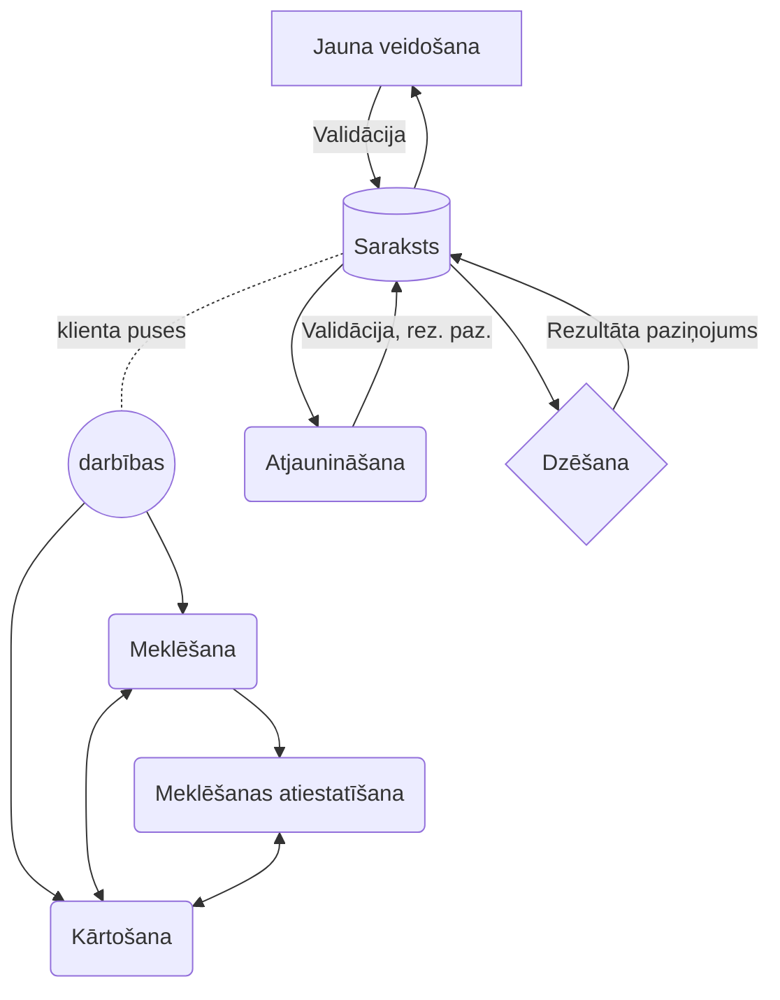

```mermaid
flowchart TB
    A[Jauna veidošana] --Validācija--> B[(Saraksts)]
    B --> A
    B -.klienta puses.-E((darbības))
    B --> C(Atjaunināšana)
    
    C -- Validācija, rez. paz. --> B
    B --> D{Dzēšana}
    D --Rezultāta paziņojums--> B
    E-->F(Meklēšana)
    E-->G(Kārtošana)
    F<-->G
    F-->H(Meklēšanas atiestatīšana)
    H<-->G
```
