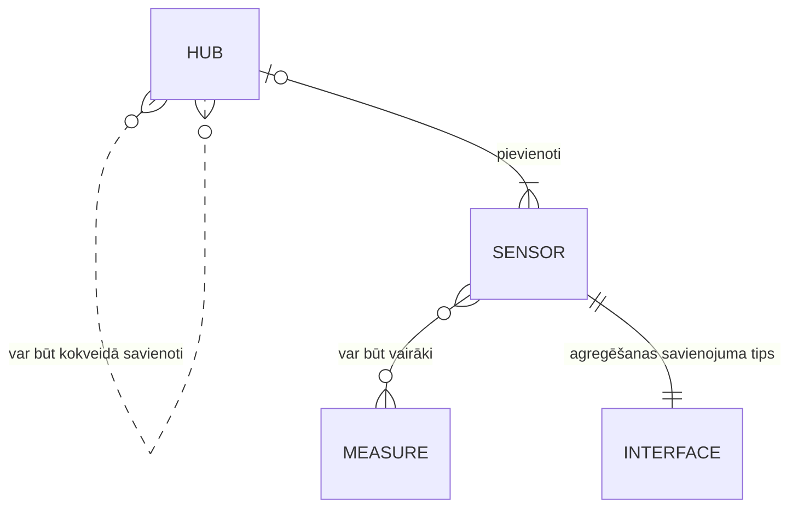

```mermaid
erDiagram
    HUB }o..o{ HUB : "var būt kokveidā savienoti"
    HUB |o--|{ SENSOR : "pievienoti"
    SENSOR }o--o{ MEASURE : "var būt vairāki"
    SENSOR ||--|| INTERFACE : "agregēšanas savienojuma tips"
```
